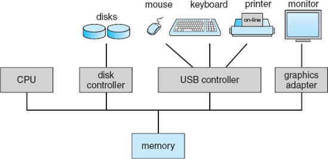
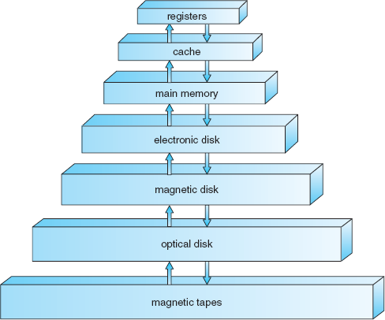
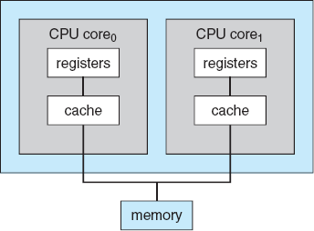
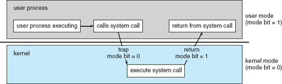

+ [Overview of Operation System](#overview-of-operation-system)
+ [What Operating Systems Do?](#what-operating-systems-do)
  + [User View](#user-view)
    + [Personal Computer](#personal-computer)
    + [Mainframe](#mainframe)
    + [Workstations](#workstations)
  + [System View](#system-view)
    + [Defining Operation System](#defining-operation-system)
+ [Computer System Organization](#computer-system-organization)
  + [Computer System Operation](#computer-system-operation)
    + [Booting up computer system](#booting-up-computer-system)
    + [Event (Interrupt) Handling](#event-interrupt-handling)
  + [Storage Structure](#storage-structure)
    + [Instruction Cycle](#instruction-cycle)
    + [Storage systems](#storage-systems)
  + [IO Structure](#io-structure)
    + [Device Controller](#device-controller)
    + [IO Operation](#io-operation)
    + [Direct Memory Access(DMA)](#direct-memory-accessdma)
+ [Computer System Architecture](#computer-system-architecture)
  + [Single Processor Systems](#single-processor-systems)
  + [Multi Processor Systems](#multi-processor-systems)
    + [Graceful degradation](#graceful-degradation)
    + [Fault tolerant](#fault-tolerant)
    + [Asymmetric MultiProcessing(AMP)](#asymmetric-multiprocessingamp)
    + [Symmetric MultiProcessing(SMP)](#symmetric-multiprocessingsmp)
      + [Non-Uniform Memory Access(NUMA)](#non-uniform-memory-accessnuma)
  + [Multi-Core System](#multi-core-system)
  + [Clustered System](#clustered-system)
    + [Asymmetric Clustering](#asymmetric-clustering)
    + [Symmetric Clustering](#symmetric-clustering)
    + [Distribution Lock Manager(DLM)](#distribution-lock-managerdlm)
+ [Operation System Structure](#operation-system-structure)
  + [Time sharing (Multitasking)](#time-sharing-multitasking)
  + [Virtual Memory](#virtual-memory)
+ [Operation System Operations](#operation-system-operations)
  + [Interrupts (Traps)](#interrupts-traps)
  + [Dual Mode Operation](#dual-mode-operation)
    + [System Calls](#system-calls)
    + [Handling Violation in Modes](#handling-violation-in-modes)
  + [Timer](#timer)

# Overview of Operation System 

An **Operating System** acts as an *intermediary between the user of a computer and the computer hardware*. The purpose of an operating system is to provide an environment in which a user can execute programs in a convenient and efficient manner.

An operating system is software that *manages the computer hardware*. The hardware must provide appropriate mechanisms to ensure the correct operation of the computer system and to prevent user programs from interfering with the proper operation of the system.

An amazing aspect of operating systems is how varied they are in accomplishing these tasks. Some operating systems are designed to be convenient, others to be efficient, and others some combination of the two.

Because an operating system is large and complex, it must be created piece by piece. Each of these pieces should be a well-described portion of the system, with carefully defined inputs, outputs, and functions.

# What Operating Systems Do?

A computer system can be divided roughly into four components: *the hardware, the operating system, the application programs, and the users*.

The hardware — **the central processing unit (CPU), the memory, and the input/output (I/O) devices**, provides the basic computing resources for the system. The application programs, such as *word processors, spreadsheets, compilers, and Web browsers*, define the ways in which these resources are used to solve users' computing problems. The operating system controls the hardware and coordinates its use among the various application programs for the various users.

## User View

The user's view of the computer varies according to the interface being used.

### Personal Computer

* Users sit in front of a PC, consisting of a monitor, keyboard, mouse, and system unit
* This system is designed for **one user to monopolize its resources**. 
* The goal is to **maximize the work (or play) that the user is performing**.
* The operating system is designed mostly for 
  * **Ease of use**.
  * **Some attention paid to performance**.
  * **No attention paid to resource utilization(how various hardware and software resources are shared)**.

### Mainframe

* A user sits at a terminal connected to a mainframe or a minicomputer. Other users are accessing the same computer through other terminals. 
* Users share resources and may exchange information. 
* The operating system is designed to **maximize resource utilization**, to assure that all available CPU time, memory, and I/O are used efficiently and that no individual user takes more than her fair share.

### Workstations

* Users sit at workstations connected to networks of other workstations and servers. 
* These users have dedicated resources at their disposal, but they also share resources such as networking and servers—file, compute, and print servers.
* The operating system is designed to **compromise between individual usability and resource utilization**.

Some computers have **little or no user view**. For example, embedded computers in home devices and automobiles may have numeric keypads and may turn indicator lights on or off to show status, but they and their operating systems are designed primarily **to run without user intervention**.

## System View

From the computer's point of view, *the operating system is the program most intimately involved with the hardware*. In this context, we can view an operating system as a **resource allocator**. 

A computer system has many resources that may be required to solve a problem: *CPU time, memory space, file-storage space, I/O devices, and so on*. The operating system acts as the manager of these resources. Facing numerous and possibly conflicting requests for resources, the operating system must decide how to allocate them to specific programs and users so that it can operate the computer system efficiently and fairly. 

A slightly different view of an operating system emphasizes the need to control the various I/O devices and user programs. An operating system is a **control program**. A control program manages the execution of user programs to prevent errors and improper use of the computer. It is especially concerned with the operation and control of I/O devices.

### Defining Operation System

Operating systems exist because **they offer a reasonable way to solve the problem of creating a usable computing system**. 

> The fundamental goal of computer systems is to execute user programs and to make solving user problems easier.

Toward this goal, computer hardware is constructed. Since bare hardware alone is not particularly easy to use, application programs are developed. These programs require certain common operations, such as those controlling the I/O devices. **The common functions of controlling and allocating resources are then brought together into one piece of software: the operating system.**

We have no universally accepted definition of what is part of the operating system. **The operating system is the one program running at all times on the computer, usually called the <u>kernel</u>**. (Along with the kernel, there are two other types of programs: **systems programs**, which are associated with the operating system but are not part of the kernel, and **application programs**, which include all programs not associated with the operation of the system.)

# Computer System Organization

## Computer System Operation

* A modern general-purpose computer system **consists of one or more CPUs and a number of device controllers connected through a common bus that provides access to shared memory**. 
* Each device controller is in charge of a specific type of device (for example, disk drives, audio devices, and video displays). 
* The CPU and the device controllers can execute concurrently, competing for memory cycles. 
* To ensure orderly access to the shared memory, a memory controller is provided whose function is to synchronize access to the memory.

### Booting up computer system
1. For a computer to start running, when it is powered up or rebooted, it needs to have an initial program to run. 
2. This initial program, or **bootstrap program**, tends to be simple. It is stored in **read-only memory (ROM) or electrically erasable programmable read-only memory (EEPROM)**, known by the general term **firmware**, within the computer hardware. 
3. It initializes all aspects of the system, from CPU registers to device controllers to memory contents. 
4. The bootstrap program must know how to load the operating system and how to start executing that system. To accomplish this goal, the bootstrap program must locate the operations-system kernel and load it into the memory.
5. The operating system then starts executing the first process, such as "init," and waits for some event to occur.

### Event (Interrupt) Handling

* The occurrence of an event is usually signaled by an interrupt from either the hardware or the software. 
* Hardware may trigger an interrupt at any time by sending a signal to the CPU, usually by way of the **system bus**. 
* Software may trigger an interrupt by executing a special operation called a **system call**.

When the CPU is interrupted, it stops what it is doing and immediately transfers execution to a fixed location. The fixed location usually contains the starting address where the service routine for the interrupt is located. The interrupt service routine executes; on completion, the CPU resumes the interrupted computation. 

* Interrupts are an important part of a computer architecture. 
* The interrupt must transfer control to the appropriate interrupt service routine. 
  * The straightforward method for handling this transfer would be to **invoke a generic routine to examine the interrupt information**; the routine, in turn, would call the interrupt-specific handler. However, interrupts must be handled quickly. 
  * Since only a predefined number of interrupts is possible, **a table of pointers to interrupt routines** can be used instead to provide the necessary speed. The interrupt routine is called indirectly through the table, with no intermediate routine needed. Generally, the table of pointers is stored in low memory (the first hundred or so locations). These locations hold the addresses of the interrupt service routines for the various devices. This array, or interrupt vector, of addresses is then *indexed by a unique device number*, given with the interrupt request, to provide the address of the interrupt service routine for the interrupting device.

The interrupt architecture must also save the address of the interrupted instruction. More recent architectures **store the return address on the system stack**. 

If the interrupt routine needs to modify the processor state, like modifying register values, **it must explicitly save the current state and then restore that state before returning**. 

After the interrupt is serviced, **the saved return address is loaded into the program counter**, and the interrupted computation resumes as though the interrupt had not occurred.

## Storage Structure

**The CPU can load instructions only from memory**, so any programs to run must be stored there. General-purpose computers run most of their programs from rewriteable memory, called **main memory** (Random Access Memory or RAM).

All forms of memory provide an array of words. Each word has its own address. 

Interaction is achieved through a sequence of *load or store instructions to specific memory addresses*. The **load** instruction moves a word from main memory to an internal register within the CPU. The **store** instruction moves the content of a register to main memory. Aside from explicit loads and stores, the CPU automatically loads instructions from main memory for execution.

### Instruction Cycle

A typical instruction–execution cycle,
1. First fetches an instruction from memory and stores that instruction in the instruction register. 
2. The instruction is then decoded and may cause operands to be fetched from memory and stored in some internal register
3. After the instruction on the operands has been executed, the result may be stored back in memory. 

Notice that **the memory unit sees only a stream of memory addresses; it does not know how they are generated or what they are for.** We can ignore how a memory address is generated by a program. We are interested only in the sequence of memory addresses generated by the running program.

Ideally, we want the programs and data to reside in main memory permanently. This arrangement usually is not possible for the following two reasons:
1. Main memory is usually **too small** to store all needed programs and data permanently.
2. Main memory is a **volatile storage device** that loses its contents when power is turned off or otherwise lost.

Most programs (system and application) are stored on a disk until they are loaded into memory. Many programs then use the disk as both the source and the destination of their processing. Hence, the proper management of disk storage is of central importance to a computer system.

### Storage systems
Each storage system provides *the basic functions of storing a datum and holding that datum until it is retrieved at a later time*. The main differences among the various storage systems lie in *speed, cost, size, and volatility*.

**Volatile storage** loses its contents when the power to the device is removed. In the absence of expensive battery and generator backup systems, data must be written to nonvolatile storage for safekeeping. 

In the hierarchy shown in Figure above, the storage systems above the electronic disk are volatile, whereas those below are nonvolatile. 

**An electronic disk can be designed to be either volatile or nonvolatile**. During normal operation, the electronic disk stores data in a large DRAM array, which is volatile. But many electronic-disk devices contain hidden magnetic hard disk and a battery for backup power. If external power is interrupted, the electronic-disk controller copies the data from RAM to the magnetic disk. When external power is restored, the controller copies the data back into RAM. 

The design of a complete memory system must balance all the factors just discussed: **it must use only as much expensive memory as necessary while providing as much inexpensive, nonvolatile memory as possible**. 

Caches can be installed to improve performance where a large access-time or transfer-rate disparity exists between two components.

## IO Structure

Storage is only one of many types of I/O devices within a computer. A large portion of operating-system code is dedicated to managing I/O, both because of its importance to the reliability and performance of a system and because of the varying nature of the devices.

### Device Controller
**Each device controller is in charge of a specific type of device**. Depending on the controller, more than one device may be attached. For instance, seven or more devices can be attached to the **small computer-systems interface (SCSI) controller**. 

A device controller maintains some *local buffer storage and a set of special-purpose registers*. 

> The device controller is responsible for moving the data between the peripheral devices that it controls and its local buffer storage. 

Typically, **operating systems have a device driver for each device controller**. This device driver understands the device controller and presents a uniform interface to the device and the rest of the operating system.

### IO Operation

To start an I/O operation, 

1. The device driver loads the appropriate registers within the device controller. 
2. The device controller examines the contents of these registers to determine what action to take (such as "read a character from the keyboard"). 
3. The controller starts the transfer of data from the device to its local buffer. 
4. Once the transfer of data is complete, the device controller informs the device driver via an interrupt that it has finished its operation. 
5. The device driver then returns control to the operating system, possibly returning the data or a pointer to the data if the operation was a read. For other operations, the device driver returns status information.

### Direct Memory Access(DMA)
*Interrupt-driven I/O* is fine for moving small amounts of data but can produce high overhead when used for bulk data movement such as disk I/O. To solve this problem, **direct memory access (DMA)** is used. 

* After setting up buffers, pointers, and counters for the I/O device, the device controller transfers an entire block of data directly to or from its own buffer storage to memory, with no intervention by the CPU. 
* Only one interrupt is generated per block, to tell the device driver that the operation has completed, rather than the one interrupt per byte generated for low-speed devices.
* While the device controller is performing these operations, the CPU is available to accomplish other work.

Some high-end systems use switch rather than bus architecture. On these systems, multiple components can talk to other components concurrently, rather than competing for cycles on a shared bus. In this case, DMA is even more effective.

# Computer System Architecture

A computer system may be organized in a number of different ways, which we can categorize roughly according to the *number of general-purpose processors* used.

## Single Processor Systems

On a single-processor system, there is **one main CPU capable of executing a general-purpose instruction set, including instructions from user processes**. Almost all systems have other special-purpose processors as well. They may come in the form of device-specific processors or io-specific processors. All of **these special-purpose processors run a limited instruction set and do not run user processes**. Eg: Graphics controller.

The use of special-purpose microprocessors is common and does not turn a single-processor system into a multiprocessor. If there is only one general-purpose CPU, then the system is a single-processor system.

## Multi Processor Systems

Multi Processor systems have two or more processors in close communication, sharing the computer bus and sometimes the clock, memory, and peripheral devices. They have three main advantages:

1. **Increased throughput**: The speed-up ratio with N processors is not N, however; rather, it is less than N. When multiple processors cooperate on a task, a certain amount of overhead is incurred in keeping all the parts working correctly. This overhead, plus contention for shared resources, lowers the expected gain from additional processors.
2. **Economy of scale**: Multiprocessor systems can cost less than equivalent multiple single-processor systems, because they can share peripherals, mass storage, and power supplies.
3. **Increased Reliability**: If functions can be distributed properly among several processors, then the failure of one processor will not halt the system, only slow it down.

### Graceful degradation

The ability to continue providing service proportional to the level of surviving hardware is called **graceful degradation**.

### Fault tolerant

Some systems go beyond  and are called **fault tolerant**, because they can suffer a failure of any single component and still continue operation. Fault tolerance requires a mechanism to allow the failure to be detected, diagnosed, and, if possible, corrected.

### Asymmetric MultiProcessing(AMP)
In **Asymmetric multiprocessing** each processor is assigned a specific task. A master processor controls the system; the other processors either look to the master for instruction or have predefined tasks. This scheme defines a master–slave relationship. The master processor schedules and allocates work to the slave processors.

### Symmetric MultiProcessing(SMP)
In **Symmetric multiprocessing (SMP)** each processor performs all tasks within the operating system. SMP means that all processors are peers; no master–slave relationship exists between processors. Each processor has its own set of registers, as well as a private or local—cache; however, all processors share physical memory.

The benefit of this model is that many processes can run simultaneously, N processes can run if there are N CPUs, without causing a significant deterioration of performance. However, we must **carefully control I/O to ensure that the data reach the appropriate processor**. Also, since the CPUs are separate, one may be sitting idle while another is overloaded, resulting in inefficiencies. These inefficiencies can be avoided if the processors share certain data structures. A multiprocessor system of this form will allow **processes and resources, such as memory,to be shared dynamically among the various processors** and can lower the variance among the processors.

#### Non-Uniform Memory Access(NUMA)
Multiprocessing adds CPUs to increase computing power. If the CPU has an integrated memory controller, then adding CPUs can also **increase the amount of memory addressable in the system**.

> Multiprocessing can cause a system to change its memory-access model from **Uniform memory access(UMA)** to **Non-Uniform Memory Access(NUMA)**. 

UMA is defined as the situation in which access to any RAM from any CPU takes the same amount of time. With NUMA, some parts of memory may take longer to access than other parts, creating a performance penalty. Operating systems can minimize the NUMA penalty through resource management

## Multi-Core System
A recent trend in CPU design is to **include multiple computing cores on a single chip**. In essence, these are multiprocessor chips. They can be more efficient than multiple chips with single cores because **on-chip communication is faster than between-chip communication**. In addition, one chip with multiple cores uses significantly less power than multiple single-core chips. As a result, multicore systems are especially well suited for server systems such as database and Web servers.

In this design, each core has its own register set as well as its own local cache; other designs might use a shared cache or a combination of local and shared caches. Aside from architectural considerations, such as cache, memory, and bus contention, these multicore CPUs appear to the operating system as N standard processors.

## Clustered System

Like multiprocessor systems, clustered systems gather together multiple CPUs to accomplish computational work. Clustered systems differ from multiprocessor systems, however, in that **they are composed of two or more individual systems(or nodes)joined together**.

Clustering is usually used to provide **high-availability service**; that is, service will continue even if one or more systems in the cluster fail. High availability is generally obtained by adding a level of redundancy in the system. **A layer of cluster software runs on the cluster nodes. Each node can monitor one or more of the others (over the LAN). If the monitored machine fails, the monitoring machine can take ownership of its storage and restart the applications that were running on the failed machine**. The users and clients of the applications see only a brief interruption of service.

### Asymmetric Clustering
In **asymmetric clustering**, one machine is in hot-standby mode while the other is running the applications. The hot-standby host machine does nothing but monitor the active server. If that server fails, the hot-standby host becomes the active server. 

### Symmetric Clustering
In **symmetric clustering**, two or more hosts are running applications and are monitoring each other. This mode is obviously more efficient, as **it uses all of the available hardware**. It does require that more than one application be available to run.

Clusters may also be used to provide **high-performance computing** environments. Such systems can supply significantly greater computational power than single-processor or even SMP systems because **they are capable of running an application concurrently on all computers in the cluster**. 

However, applications must be written specifically to take advantage of the cluster by using a technique known as **parallelization**, which consists of dividing a program into separate components that run in parallel on individual computers in the cluster. Typically, these applications are designed so that once each computing node in the cluster has solved its portion of the problem, the results from all the nodes are combined into a final solution.

### Distribution Lock Manager(DLM)
Each machine has full access to all data in the database. To provide this shared access to data, the system must also supply **access control and locking** to ensure that no conflicting operations occur. This function, commonly known as a **distributed lock manager(DLM)**.

# Operation System Structure

One of the most important aspects of operating systems is the **ability to multiprogram**. A single program cannot, in general, keep either the CPU or the I/O devices busy at all times. Single users frequently have multiple programs running. **Multiprogramming** increases CPU utilization by organizing jobs (code and data) so that the CPU always has one to execute.

> The operating system keeps several jobs in memory simultaneously.

* Main memory is too small to accommodate all jobs, the jobs are kept initially on the disk in the **job pool**. This pool consists of all processes residing on disk awaiting allocation of main memory.
* The set of jobs in memory can be a subset of the jobs kept in the job pool. 
* The operating system picks and begins to execute one of the jobs in main memory. 
* Eventually, the job may have to wait for some task, such as an I/O operation, to complete. In a non-multiprogrammed system, the CPU would sit idle. In a multiprogrammed system, the operating system simply switches to, and executes, another job. When that job needs to wait, the CPU is switched to another job, and so on. Eventually, the first job finishes waiting and gets the CPU back. 

> As long as at least one job needs to execute, the CPU is never idle.

## Time sharing (Multitasking)
**Multiprogrammed systems** provide an environment in which the various system resources (for example, CPU, memory, and peripheral devices) are utilized effectively, but **they do not provide for user interaction with the computer system**.

**Time sharing (or multitasking**)* is a logical extension of multiprogramming. In time-sharing systems, the CPU executes multiple jobs by switching among them, but the switches occur so frequently that **the users can interact with each program while it is running**.

Time sharing requires an interactive (or hands-on) computer system, which provides direct communication between the user and the system. The user gives instructions to the operating system or to a program directly, using a input device such as a keyboard or a mouse, and waits for immediate results on an output device. Accordingly, the response time should be short—typically less than one second.

**A time-shared operating system allows many users to share the computer simultaneously**. Since each action or command in a time-shared system tends to be short, only a little CPU time is needed for each user. As the system switches rapidly from one user to the next, each user is given the impression that the entire computer system is dedicated to his use, even though it is being shared among many users.

A time-shared operating system **uses CPU scheduling and multiprogramming** to provide each user with a small portion of a time-shared computer.  **Each user has at least one separate program in memory**. 

> A program loaded into memory and executing is called a **process**. 

When a process executes, it typically executes for only a short time before it either finishes or needs to perform I/O. Since interactive I/O typically runs at "people speeds," it may take a long time to complete. Rather than let the CPU sit idle as this interactive input takes place, *the operating system will rapidly switch the CPU to the program of some other user*.

Time sharing and multiprogramming require that several jobs be kept simultaneously in memory. If several jobs are ready to be brought into memory, and if there is not enough room for all of them, then the system must choose among them. Making this decision is **job scheduling**.

When the operating system selects a job from the job pool, it loads that job into memory for execution. Having several programs in memory at the same time requires some form of **memory management**.

If several jobs are ready to run at the same time, the system must choose among them. Making this decision is **CPU scheduling**.

Running multiple jobs concurrently requires that their ability to affect one another be limited in all phases of the operating system, including process scheduling, disk storage, and memory management.

## Virtual Memory

In a time-sharing system, the operating system must ensure reasonable response time, which is sometimes accomplished through **swapping**, where **processes are swapped in and out of main memory to the disk**. 

A more common method for achieving this goal is **virtual memory**, a technique that **allows the execution of a process that is not completely in memory**. 

The main advantage of the virtual-memory scheme is that it enables users to **run programs that are larger than actual physical memory**. Further, it abstracts main memory into a large, uniform array of storage, separating logical memory as viewed by the user from physical memory. This arrangement **frees programmers from concern over memory-storage limitations**.

# Operation System Operations

Modern operating systems are **interrupt driven**. If there are *no processes to execute, no I/O devices to service, and no users to whom to respond*, an operating system will **sit idle**, waiting for something to happen.

## Interrupts (Traps)

> Events are almost always signaled by the occurrence of an **interrupt** or a **trap**.

A trap (or an exception) is a software-generated interrupt caused either by an error or by a specific request from a user program that an operating-system service be performed.The interrupt-driven nature of an operating system defines that system's general structure. 
 
For each type of interrupt, separate segments of code in the operating system determine what action should be taken. An **interrupt service routine** is provided that is responsible for dealing with the interrupt.

Since the operating system and the users share the hardware and software resources of the computer system, **we need to make sure that an error in a user program could cause problems only for the one program running**. With sharing, many processes could be adversely affected by a bug in one program.

> A properly designed operating system must ensure that an incorrect (or malicious) program cannot cause other programs to execute incorrectly.

## Dual Mode Operation

In order to ensure the proper execution of the operating system, we must be able to distinguish between the execution of **operating-system code** and **user-defined code**. 

At the very least, we need two separate modes of operation: **user mode** and **kernel mode** (**supervisor mode**, **system mode**, or **privileged mode**). 

A bit, called the **mode bit**, is added to the hardware of the computer to indicate the current mode: **kernel (0) or user (1)**. With the mode bit, we are able to distinguish between a task that is executed on behalf of the operating system and one that is executed on behalf of the user.

When the computer system is executing on behalf of a user application, the system is in user mode. However, when a user application requests a service from the operating system (via a system call), **it must transition from user to kernel mode** to fulfill the request.

1. At system boot time, the hardware starts in kernel mode.
2. The operating system is then loaded and starts user applications in user mode.
3. Whenever a trap or interrupt occurs, the hardware switches from user mode to kernel mode.
4. Whenever the operating system gains control of the computer, it is in kernel mode. 
5. The system always switches to user mode,before passing control to a user program.

* The dual mode of operation provides us with the means for **protecting the operating system from errant users** and **errant users from one another**.
* We accomplish this protection by **designating some of the machine instructions that may cause harm as privileged instructions**. 
* The hardware allows **privileged instructions to be executed only in kernel mode**. 
* If an attempt is made to execute a privileged instruction in user mode, the hardware does not execute the instruction but rather treats it as illegal and traps it to the operating system.

### System Calls

**System calls** provide the means for a user program to ask the operating system to perform tasks reserved for the operating system on the user program's behalf. A system call is invoked in a variety of ways, depending on the functionality provided by the underlying processor. In all forms, it is the method used by a process to request action by the operating system.

1. When a system call is executed, it is treated by the hardware as a software interrupt.
2. Control passes through the interrupt vector to a service routine in the operating system, and the mode bit is set to kernel mode. 
3. The system-call service routine is a part of the operating system. 
4. The kernel examines the interrupting instruction to determine what system call has occurred; a parameter indicates what type of service the user program is requesting. Additional information needed for the request may be passed in registers, on the stack, or in memory (with pointers to the memory locations passed in registers). 
5. The kernel verifies that the parameters are correct and legal, executes the request, and returns control to the instruction following the system call.

### Handling Violation in Modes

1. Once hardware protection is in place, it detects errors that violate modes. These errors are normally handled by the operating system. 
2. If a user program fails in some way, such as by **making an attempt either to execute an illegal instruction** or **to access memory that is not in the user's address space**, then the hardware traps to the operating system.
3. The trap transfers control through the interrupt vector to the operating system, just as an interrupt does. 
4. When a program error occurs, **the operating system must terminate the program abnormally**. 
5. This situation is handled by the same code as a user-requested abnormal termination. 
6. An appropriate error message is given, and **the memory of the program may be dumped**. 
7. The memory dump is usually written to a file so that the user or programmer can examine it and perhaps correct and restart the program.

## Timer
We must ensure that the operating system maintains control over the CPU. **We cannot allow a user program to get stuck in an infinite loop or to fail to call system services and never return control to the operating system**. To accomplish this goal, we can use a timer.

**A timer can be set to interrupt the computer after a specified period**. The period may be fixed (for example, 1/60 second) or variable (for example, from 1 millisecond to 1 second). A variable timer is generally implemented by a fixed-rate clock and a counter. The operating system sets the counter. Every time the clock ticks, the counter is decremented. 

When the counter reaches 0, an interrupt occurs. If the timer interrupts, control transfers automatically to the operating system, which may treat the interrupt as a fatal error or may give the program more time.

We can use the timer to prevent a user program from running too long. A simple technique is to initialize a counter with the amount of time that a program is allowed to run. When the counter becomes negative, the operating system terminates the program for exceeding the assigned time limit.

