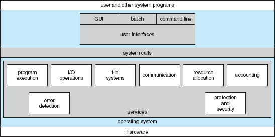
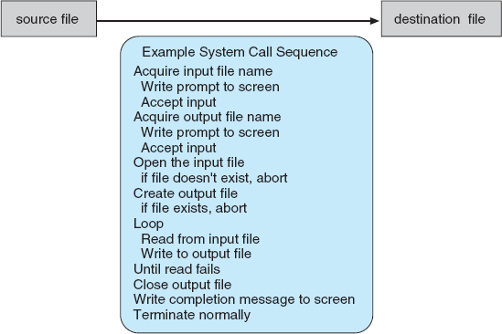
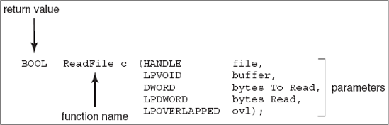
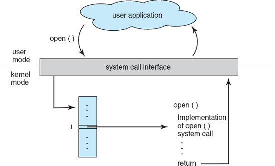
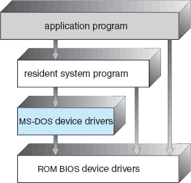
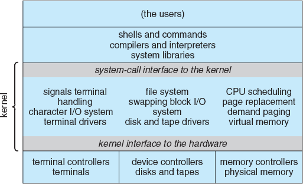
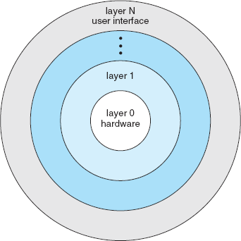

+ [Operating System Structures](#operating-system-structures)
+ [Operating System Services](#operating-system-services)
+ [User Operation System Interface](#user-operation-system-interface)
  + [Command Interpreter](#command-interpreter)
  + [Graphical User Interfaces(GUI)](#graphical-user-interfacesgui)
+ [System Calls](#system-calls)
    + [Application Programming Interface(API)](#application-programming-interfaceapi)
    + [System Call Interface](#system-call-interface)
    + [Passing parameters to Operation System](#passing-parameters-to-operation-system)
+ [Types of System Calls](#types-of-system-calls)
+ [System Programs](#system-programs)
+ [Operating System Design and Implementation](#operating-system-design-and-implementation)
  + [Design Goals](#design-goals)
  + [Mechanisms and Policies](#mechanisms-and-policies)
  + [Implementation](#implementation)
+ [Operating System Structure](#operating-system-structure)
  + [Simple Structure](#simple-structure)
  + [Layered Approach](#layered-approach)
  + [Microkernels](#microkernels)
  + [Modules](#modules)

# Operating System Structures

An operating system provides the environment within which programs are executed. We can view operating system from several vantage points:
1. via services the system provides.
2. via the interface it makes available to users and programmers.
3. via its components and their interconnections.

# Operating System Services

Operating system provides certain services to programs and to the users of those programs. These services are provided for the convenience of the programmer, to make the programming task easier.

Services that are helpful to the user are:
1. **User Interface**: Almost all operating systems have a user interface (UI). This interface can take several forms. 
   1. **Command-Line interface(CLI)**, which uses text commands and a method for entering them (say, a program to allow entering and editing of commands).
   2. **Batch interface**, in which commands and directives to control those commands are entered into files, and those files are executed.
   3. A **graphical user interface (GUI)**, this interface is a window system with a pointing device to direct I/O, choose from menus, and make selections and a keyboard to enter text.
2. **Program Execution**: The system must be able to load a program into memory and to run that program. The program must be able to end its execution, either normally or abnormally(indicating error).
3. **I/O Operations**: A running program may require I/O, which may involve a file or an I/O device. For specific devices, special functions may be desired (such as recording to a CD or DVD drive or blanking a display screen). For efficiency and protection, users usually cannot control I/O devices directly. Therefore, the operating system must provide a means to do I/O.
4. **File-system manipulation**: The file system is of particular interest. Obviously, programs need to read and write files and directories. They also need to create and delete them by name, search for a given file, and list file information. Finally, some programs include permissions management to allow or deny access to files or directories based on file ownership. Many operating systems provide a variety of file systems, sometimes to allow personal choice, and sometimes to provide specific features or performance characteristics.
5. **Communications**: There are many circumstances in which one process needs to exchange information with another process. Such communication may occur between processes that are executing on the same computer or between processes that are executing on different computer systems tied together by a computer network. **Communications may be implemented via shared memory or through message passing**, in which packets of information are moved between processes by the operating system.
6. **Error detection**: **The operating system needs to be constantly aware of possible errors**. Errors may occur in the CPU and memory hardware (such as a memory error or a power failure), in I/O devices (such as a parity error on tape, a connection failure on a network, or lack of paper in the printer), and in the user program (such as an arithmetic overflow, an attempt to access an illegal memory location, or a too-great use of CPU time). **For each type of error, the operating system should take the appropriate action to ensure correct and consistent computing**.

Some services or functions exists not for helping the user but rather for ensuring the efficient operation of the system itself. Systems with multiple users gain efficiency by sharing the computer resources among the users.

7. **Resource Allocation**: When there are multiple users or multiple jobs running at the same time, resources must be allocated to each of them. **Many different types of resources are managed by the operating system**. Some (such as CPU cycles, main memory, and file storage) may have special allocation code, whereas others (such as I/O devices) may have much more general request and release code. For instance, in determining how best to use the CPU, operating systems have **CPU-scheduling routines that take into account the speed of the CPU, the jobs that must be executed, the number of registers available, and other factors**. There may also be routines to allocate printers, modems, USB storage drives, and other peripheral devices.
8. **Accounting**: We want to keep track of which users use how much and what kinds of computer resources. This record keeping may be used for accounting (so that users can be billed) or simply for accumulating usage statistics. Usage statistics may be a valuable tool for researchers who wish to reconfigure the system to improve computing services.
9. **Protection and Security**: The owners of information stored in a multiuser or networked computer system may want to control use of that information. **When several separate processes execute concurrently, it should not be possible for one process to interfere with the others or with the operating system itself**. Protection involves ensuring that all access to system resources is controlled. Security of the system from outsiders is also important. Such security starts with requiring each user to authenticate himself or herself to the system, usually by means of a password, to gain access to system resources. It extends to defending external I/O devices, including modems and network adapters, from invalid access attempts and to recording all such connections for detection of break-ins. If a system is to be protected and secure, precautions must be instituted throughout it. **A chain is only as strong as its weakest link**.

# User Operation System Interface

## Command Interpreter
Some operating system include the command interpreter in the kernel. While others treat the command interpreter as a special program that is running when a job is initiated or when a user first logs on .

On systems with multiple command interpreters to choose from, the interpreteres are known as **shells**. Eg: Bourne shell, C shell, Bourne-Again Shell etc.

> The main function of the command interpreter is to get and execute the next user-specifed command.

Many commands given at this level manipulate files: *create, delete, list, print, copy, execute, and so on*.  These commands can be implemented in two ways:
1. Command interpreter contains the code to execute the command. Eg: A command to delete a file may cause the command interpreter to jump to a section of its code that sets up the parameters and makes the appropriate system call. The number of commands that can be given determines the size of command interpreter, since it needs to have its own implementation code.
2. Commands are implemented through system programs like UNIX. Command interpreter does not understand the command in any way; it merely uses the command to identify a file to be loaded into memory and executed. Eg: `rm file.txt` would search for the file called `rm`, load the file into memory, and execute it with the parameter `file.txt`. The function associated with the `rm` command would be defined completely by the code in the `rm` file. This way, programmers can add new commands to the system easily by creating new files with the proper names. Interpreter program can be small and does not have to be changed for every new command.

## Graphical User Interfaces(GUI)

Rather than entering commands directly via command-line-interface, users employ a mouse-based window-and-menu system charcterised by a **desktop** metaphor. The user moves the mouse to position its pointer on images(icons) on the screen(desktop) that represents programs, files, directories, and system functions. 

Depending on the mouse pointer's location, clicking a button on the mouse can invoke a program, select a file or directory(folder) or pull down a menu that contains commands.

The user interface can vary from system to system and even from user to user within a system. **The design of a useful and friendly user interface is therefore not a direct function of operation system**. 

From the point of view of the operation system, we do not distingush between user programs and system programs.

# System Calls

**System calls** provide an interface to the services made available by an operating system. These calls are generally available as routines written in C and C++, although certain low-level tasks (for example, tasks where hardware must be accessed directly) may need to be written using assembly-language instructions.

Lets consider an program where we need to read the data from one file and copy them to another file.

1. The first input that the program will need is the names of the two files: the `input file` and the `output file`.
2. These filenames can be specified in many ways, one approach is to ask the user for the names of the two files. In an interactive system, this approach **will require a sequence of system calls**, first to write a prompting message on the screen and then to read from the keyboard the characters that define the two files. On mouse-based and icon-based systems, a menu of file names is usually displayed in a window. The user can then use the mouse to select the source name, and a window can be opened for the destination name to be specified. This sequence requires many I/O system calls.
3. Once the two file names are obtained, the program must `open the input file` and `create the output file`. Each of these operations **requires another system call**. 
4. There are also possible error conditions for each operation. When the program tries to open the input file, it may find that there is **no file of that name or that the file is protected against access**. In these cases, the program should **print a message on the console** (another sequence of system calls) and then **terminate abnormally** (another system call).
5. If the input file exists, then we must create a new output file. We may find that **there is already an output file with the same name**. This situation may cause the program to **abort** (a system call), or **we may delete the existing file** (another system call) and **create a new one** (another system call). Another option, in an interactive system, is **to ask the user** (via a sequence of system calls to output the prompting message and to read the response from the terminal) **whether to replace the existing file or to abort the program**.
6. Now that both files are set up, **we enter a loop that reads from the input file(a system call) and writes to the output file (another system call)**. Each read and write must return status information regarding various possible error conditions. On input, the program may find that the **end of the file has been reached** or that **there was a hardware failure in the read (such as a parity error)**. The write operation may encounter various errors, depending on the output device (no more disk space, printer out of paper, and so on).
7. Finally, after the entire file is copied, the program may close both files (another system call), write a message to the console or window (more system calls), and finally terminate normally (the final system call).

As we can see, even simple programs may make heavy use of the operating system. Frequently, systems execute thousands of system calls per second.

### Application Programming Interface(API)
Application developers design programs according to an **application programming interface(API)**. 

> The API specifies a set of functions that are available to an application programmer, including the parameters that are passed to each function and the return values the programmer can expect. 

Three of the most common APIs available to application programmers are the Win32 API for Windows systems, the POSIX API for POSIX-based systems (which include virtually all versions of UNIX, Linux, and Mac OS X), and the Java API for designing programs that run on the Java virtual machine.

Behind the scenes, the functions that make up an API typically invoke the actual system calls on behalf of the application programmer. 

**Why would an application programmer prefer programming according to an API rather than invoking actual system calls?**
1. Programming according to an API concerns program portability: An application programmer designing a program using an API can expect her program to compile and run on any system that supports the same API.
2. Actual system calls can often be more detailed and difficult to work with than the API available to an application programmer.
3. There often exists a strong correlation between a function in the API and its associated system call within the kernel.

As an example of a standard API, consider the `ReadFile()` function in the Win32 API — a function for reading from a file. The API for this function is as below:

A description of the parameters passed to ReadFile() is as follows:
* **HANDLE** file—the file to be read
* **LPVOID** buffer—a buffer where the data will be read into and written from
* **DWORD** bytesToRead—the number of bytes to be read into the buffer
* **LPDWORD** bytesRead—the number of bytes read during the last read
* **LPOVERLAPPED** ovl—indicates if overlapped I/O is being used

### System Call Interface

The run-time support system (a set of functions built into libraries included with a compiler) for most programming languages provides a **system-call interface** that serves as the link to system calls made available by the operating system. The system-call interface intercepts function calls in the API and invokes the necessary system calls within the operating system. Typically, a number is associated with each system call, and the system-call interface maintains a table indexed according to these numbers. The system call interface then invokes the intended system call in the operating-system kernel and returns the status of the system call and any return values.

The caller need know nothing about how the system call is implemented or what it does during execution. Rather, it need only obey the API and understand what the operating system will do as a result of the execution of that system call. Thus, most of the details of the operating-system interface are hidden from the programmer by the API and are managed by the run-time support library.

### Passing parameters to Operation System

Three general methods are used to pass parameters to the operating system. 

1. The simplest approach is to **pass the parameters in registers**.
2. There may be more parameters than registers, then the parameters are generally stored in a block, or table, in memory, and **the address of the block is passed as a parameter in a register**. This is the approach taken by Linux and Solaris. 
3. **Parameters also can be placed, or pushed, onto the stack** by the program and popped off the stack by the operating system. 

Some operating systems prefer the block or stack method because those approaches do not limit the number or length of parameters being passed.

# Types of System Calls

System calls can be grouped roughly into six major categories: 
1. Process control
   * end, abort
   * load, execute
   * create or terminate process
   * get or set process attributes
   * wait for time
   * wait event, signal event
   * allocate and free memory
2. File manipulation
   * create, delete file
   * open, close
   * read, write, reposition
   * get or set file attributes 
3. Device manipulation
   * request or release device 
   * read, write, reposition
   * get or set device attributes
   * logically attach or detach devices
4. Information maintenance
   * get or set date and time
   * get or set system data
   * get process, file, or device attributes
   * set process, file, or device attributes
5. Communications
   * create, delete communication connection
   * send, receive messages
   * transfer status information
   * attach or detach remote devices
6. Protection
   * lock, unlock shared data.
   * get or set permission for resources
   * allow or deny user for certain resource

# System Programs

**System programs**, also known as **system utilities**, provide a convenient environment for program development and execution. Some of them are simply user interfaces to system calls; others are considerably more complex. They can be divided into these categories:
1. **File Management**: These programs create, delete, copy, rename, print, dump, list, and generally manipulate files and directories.
2. **Status Information**: Some programs simply ask the system for the date, time, amount of available memory or disk space, number of users, or similar status information. Others are more complex, providing detailed performance, logging, and debugging information. Typically, these programs format and print the output to the terminal or other output devices or files or display it in a window of the GUI. Some systems also support a **registry**, which is used to store and retrieve configuration information.
3. **File Modification**: Several text editors may be available to create and modify the content of files stored on disk or other storage devices. There may also be special commands to search contents of files or perform transformations of the text.
4. **Programming language support**: Compilers, assemblers, debuggers, and interpreters for common programming languages (such as C, C++, Java, Visual Basic, and PERL) are often provided to the user with the operating system.
5. **Program Loading and execution**: Once a program is assembled or compiled, it must be loaded into memory to be executed. The system may provide **absolute loaders, relocatable loaders, linkage editors, and overlay loaders**. Debugging systems for either higher-level languages or machine language are needed as well.
6. **Communications**: These programs provide the mechanism for creating virtual connections among processes, users, and computer systems. They allow users to send messages to one another's screens, to browse Web pages, to send electronic-mail messages, to log in remotely, and to transfer files from one machine to another.

In addition to systems programs, most operating systems are supplied with **application programs** that are useful in solving common problems or performing common operations. Such application programs include *Web browsers, word processors and text formatters, spreadsheets, database systems, compilers, plotting and statistical-analysis packages, and games*.

# Operating System Design and Implementation

## Design Goals

The first problem in designing a system is to define goals and specifications. At the highest level, the design of the system will be affected by the choice of hardware and the type of system: batch, time shared, single user, multiuser, distributed, real time, or general purpose.

Beyond this highest design level, the requirements may be much harder to specify. The requirements can, however, be divided into two basic groups: user goals and system goals.

The system should be convenient to use, easy to learn and to use, reliable, safe, and fast.

The system should be easy to design, implement, and maintain; and it should be flexible, reliable, error free, and efficient.

> In short, there is no unique solution to the problem of defining the requirements for an operating system. 

## Mechanisms and Policies

> **Mechanisms** determine how to do something; **policies** determine what will be done.

For example, the timer construct is a mechanism for ensuring CPU protection, but deciding how long the timer is to be set for a particular use is a policy decision.

**The separation of policy and mechanism is important for flexibility**. Policies are likely to change across places or over time. In the worst case, each change in policy would require a change in the underlying mechanism. 

> A general mechanism insensitive to changes in policy would be more desirable.

A change in policy would then require redefinition of only certain parameters of the system. 

## Implementation
Once an operating system is designed, it must be implemented. Traditionally, operating systems have been written in assembly language. Now, however, they are most commonly written in higher-level languages such as C or C++.

The advantages of using a higher-level language, or at least a systems-implementation language, for implementing operating systems are the same as those accrued when the language is used for application programs: 
* The code can be written faster.
* Code is more compact.
* Code is easier to understand and debug. 
* Improvements in compiler technology will improve the generated code for the entire operating system by simple recompilation. 
* An operating system is far easier to port—to move to some other hardware, if it is written in a higher-level language.

The only possible disadvantages of implementing an operating system in a higher-level language are reduced speed and increased storage requirements. These, however, are no longer major issues in today's systems. 

Although operating systems are large, only a small amount of the code is critical to high performance; **the memory manager and the CPU scheduler** are probably the most critical routines. After the system is written and is working correctly, bottleneck routines can be identified and can be replaced with assembly-language equivalents.

# Operating System Structure

A system as large and complex as a modern operating system must be engineered carefully if it is to function properly and be modified easily. A common approach is to **partition the task into small components rather than have one monolithic system**. Each of these modules should be a **well-defined portion of the system, with carefully defined inputs, outputs, and functions**.

## Simple Structure

Many commercial operating systems do not have well-defined structures. Frequently, such systems started as small, simple, and limited systems and then grew beyond their original scope. It was originally designed and implemented by a few people who had no idea that it would become so popular. It was written to provide the most functionality in the least space, so it was not divided into modules carefully.

Eg: In MS-DOS, the interfaces and levels of functionality are not well separated. 

For instance, application programs are able to access the basic I/O routines to write directly to the display and disk drives. Such freedom leaves MS-DOS vulnerable to errant (or malicious) programs, causing entire system crashes when user programs fail. **MS-DOS was also limited by the hardware of its era.**

Like MS-DOS, UNIX initially was limited by hardware functionality. It consists of two separable parts: **the kernel and the system programs**. The kernel is further separated into a series of interfaces and device drivers that have been added and expanded over the years as UNIX has evolved. 

Everything below the system-call interface and above the physical hardware is the kernel. The kernel provides the file system, CPU scheduling, memory management, and other operating-system functions through system calls. **Taken in sum, that is an enormous amount of functionality to be combined into one level. This monolithic structure was difficult to implement and maintain.**

## Layered Approach

With proper hardware support, operating systems can be broken into pieces that are smaller and more appropriate. **The operating system can then retain much greater control over the computer and over the applications that make use of that computer**.

Under a top-down approach, the overall functionality and features are determined and are separated into components. **Information hiding is also important**, because it leaves programmers free to implement the low-level routines as they see fit, provided that the external interface of the routine stays unchanged and that the routine itself performs the advertised task.

A system can be made modular in many ways. One method is the **layered approach, in which the operating system is broken into a number of layers (levels)**. The bottom layer (layer 0) is the hardware; the highest (layer N) is the user interface.

An operating-system layer is an implementation of an abstract object made up of data and the operations that can manipulate those data. A typical operating-system layer,say layer M, consists of data structures and a set of routines that can be invoked by higher-level layers. Layer M, in turn, can invoke operations on lower-level layers.

The main advantage of the layered approach is **simplicity of construction and debugging**. The layers are selected so that each uses functions (operations) and services of only lower-level layers.

**Each layer is implemented with only those operations provided by lower-level layers**. A layer does not need to know how these operations are implemented; it needs to know only what these operations do. Hence, **each layer hides the existence of certain data structures, operations, and hardware from higher-level layers**.

The major difficulty with the layered approach involves **appropriately defining the various layers**. Because a layer can use only lower-level layers, careful planning is necessary. 

A final problem with layered implementations is that they tend to be **less efficient than other types**. For instance, when a user program executes an I/O operation, it executes a system call that is trapped to the I/O layer, which calls the memory-management layer, which in turn calls the CPU-scheduling layer, which is then passed to the hardware. At each layer, the parameters may be modified, data may need to be passed, and so on. **Each layer adds overhead to the system call; the net result is a system call that takes longer than does one on a nonlayered system**.

## Microkernels

This method structures the operation system by removing all nonessential components from the kernel and implementing them as system and user-level programs resulting in a smaller kernel. Microkernels provide minimal process and memory management, in addition to a communication facility.

The main function of the microkernel is to provide a communication facility between the client program and the various services that are also running in user space. Communication is provided by message passing. For example, if the client program wishes to access a file, it must interact with the file server. The client program and service never interact directly. Rather, they communicate indirectly by exchanging messages with the microkernel.

The beneifts are:
1. Ease of extending the operating system. All new services are added to user space and consequently do not require modification of the kernel.
2. When the kernel does have to be modified, the changes tend to be fewer, because the microkernel is a smaller kernel.
3. The resulting operating system is easier to port from one hardware design to another.
4. The microkernel also provides more security and reliability, since most services are running as user—rather than kernel—processes. If a service fails, the rest of the operating system remains untouched.

Microkernels can suffer from **performance decreases due to increased system function overhead**. 

## Modules

The best current methodology for operating-system design involves using object-oriented programming techniques to create a modular kernel. **The kernel has a set of core components and links in additional services either during boot time or during run time**.

In Solaris, operating system structure is organized around a core kernel with seven types of loadable kernel modules:
1. Scheduling classes
2. File systems
3. Loadable system calls
4. Executable formats
5. STREAMS modules
6. Miscellaneous
7. Device and bus drivers

Advantages of this design:
1. Allows kernel to provide core services yet also allows certain features to be implemented dynamically.
2. It resembles a layered system in that each kernel section has defined, protected interfaces, but it is more flexible than a layered system in that any module can call any other module.
3. It is like micorkernel in that the primary module has only core functions and knowledge of how to load and communicate with other modules, but it is more efficient because modules do not need to invoke message passing in order to communicate.